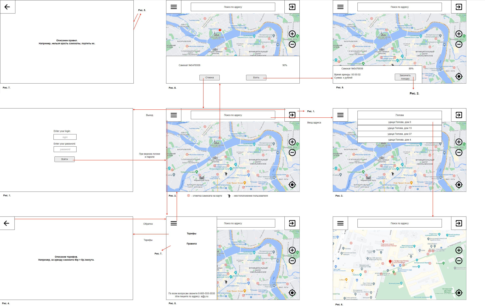
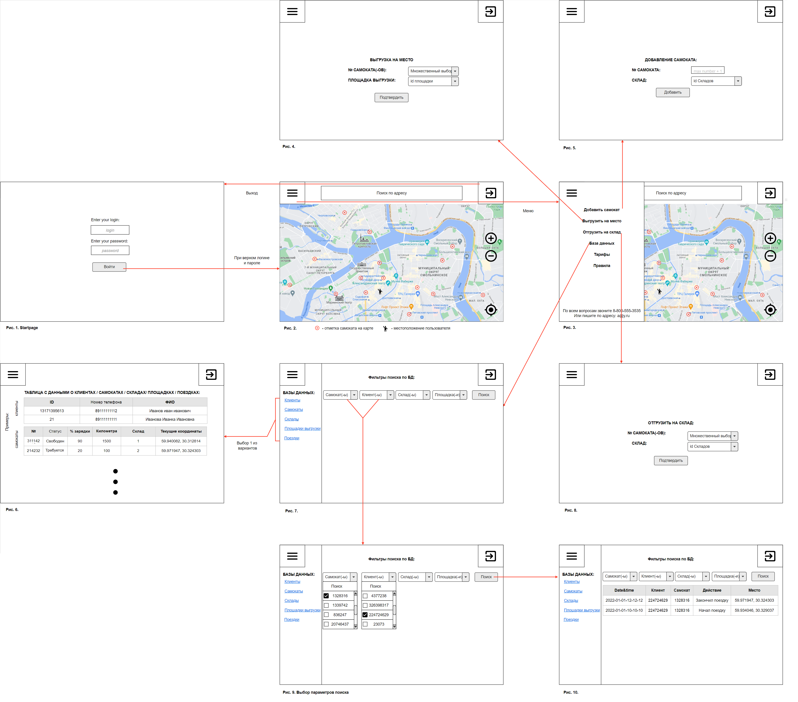

# Use case

### Сценарии использования для пользователя.

#### Сценарий использования "Аутентификация"

<ins>Основной сценарий</ins>: 

1) Действующее лицо вводит свои логин и пароль
2) Нажимает кнопку войти
3) Успешный вход в систему, переход на страницу с картой, на которой отмечены самокаты

<ins>Альтернативный сценарий</ins>:

1) Действующее лицо вводит свои логин и пароль
2) Нажимает кнопку войти
3) Данные введены неверно, остается на этой же странице, переходит к шагу 1

#### Сценарий использования "Выход"

<ins>Основной сценарий</ins>: 

1) Действующее лицо нажимает кнопку выхода в правом верхнем углу
2) Оказыается на странице аутентификации

#### Сценарий использования "Просмотр информации о самокате"

<ins>Основной сценарий</ins>: 

1) Пользователь выбирает одну из точек на карте, которой отмечен самокат
2) Нажимает
3) Появляюется информация о самокате: его номер и процент заряда, а также варианты "взять" и "отмена"

#### Сценарий использования "Аренда самоката"

<ins>Основной сценарий</ins>: 

1-3) То же, что в "Просмотр информации о самокате"
4) Нажимает кнопку взять
5) Начинается поездка, на экране есть информация о взятом самокате, время и сумма поездки

#### Сценарий использования "Завершение поездки"

<ins>Основной сценарий</ins>: 

1) При условии, что пользователь уже взял самокат: нажать "Закончить поездку"
2) Поездка окончена, карта принимает изначальный вид (рис. 2)

#### Сценарий использования "Просмотр тарифов/правил"

<ins>Основной сценарий</ins>: 

1) Нажать на кнопку меню в левом верхнем углу
2) Выбрать вариант тарифы/правила
3) Происходит переход на страницу, где описаны тарифы/правила

#### Сценарий использования "Поиск по адресу"

<ins>Основной сценарий</ins>: 

1) Пользователь вводит адрес в поисковую строку
2) Выбирает из предложенных
3) Происходит перемещение и масштабирование карты так, чтобы в центре был выбранный адрес

## Макет пользовательского интерфейса

### Сценарии использования для работника.
Работник имеет те же возможности, что пользователь + те, что будут описаны ниже

#### Сценарий использования "Добавление самоката"

<ins>Основной сценарий</ins>: 

1) Работник открывает меню (кнопка в левом верхнем углу)
2) Выбирает пункт "Добавить самокат"
3) Происходит переход на страницу добавления
4) Заполняет поля "№ самоката" и выбирает склад, на котором будет храниться самокат
5) Нажимает "Добавить"

#### Сценарий использования "Выгрузка на площадку"

<ins>Основной сценарий</ins>: 

1) Работник открывает меню (кнопка в левом верхнем углу)
2) Выбирает пункт "Выгрузка на место"
3) Происходит переход на страницу добавления
4) Заполняет поля "№ самоката" и выбирает площадку, на которую выгружает
5) Нажимает "Подтвердить"

#### Сценарий использования "Отгрузка на склад"

<ins>Основной сценарий</ins>: 

1) Работник открывает меню (кнопка в левом верхнем углу)
2) Выбирает пункт "Отгрузка на склад"
3) Происходит переход на страницу добавления
4) Заполняет поля "№ самоката" и выбирает склад, на который отгрузит самокаты
5) Нажимает "Подтвердить"

#### Сценарий использования "Просмотр БД клиентов/самокатов/складов/площадок выгрузки/поездок"

<ins>Основной сценарий</ins>: 

1) Работник открывает меню (кнопка в левом верхнем углу)
2) Выбирает пункт "Базы данных"
3) Происходит переход на страницу с выбором бд и поиском по бд
3) Выбирает пункт "Клиенты"/"Самокаты"/"Склады"/"Площадки выгрузки"/"Поездки"
4) Происходит переход на страницу, где представлена таблица со всеми даныыми о выбранном пункте (Примеры таблиц на рис. 6 макета работников)

#### Сценарий использования "Просмотр БД клиентов/самокатов/складов/площадок выгрузки/поездок"

<ins>Основной сценарий</ins>: 

1) Работник открывает меню (кнопка в левом верхнем углу)
2) Выбирает пункт "Базы данных"
3) Происходит переход на страницу с выбором бд и поиском по бд
4) Работник выбирает необходимые ему данные. Например, определенный самокат и клиента
5) Нажимает "Поиск"
6) Появляется таблица, которая содержит в себе найденные данные. Например, все записи, где есть выбранный самокат и клиент.

## Макет интерфейса для работников

